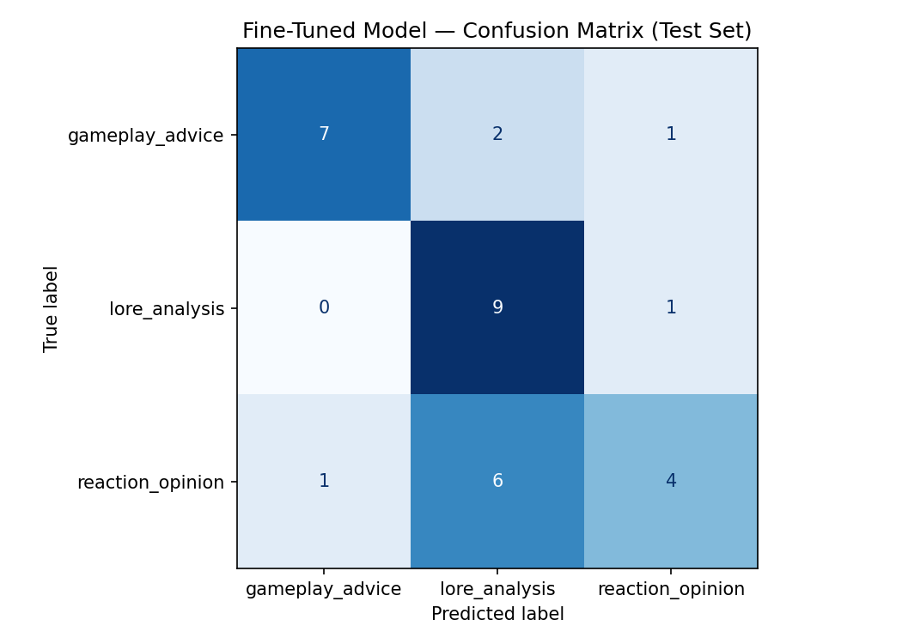

# TakeMeter

TakeMeter is a fine-tuned text classifier that evaluates discourse type in the r/GenshinImpact online community. The goal of this project is to classify public Reddit posts and comments into meaningful discussion categories based on the main purpose of the text.

The classifier uses three labels:

- `gameplay_advice`
- `lore_analysis`
- `reaction_opinion`

I fine-tuned a DistilBERT model on my labeled dataset and compared it against a zero-shot baseline using Groq's `llama-3.3-70b-versatile`.

---

## Community Choice

I chose **r/GenshinImpact**, a Reddit community focused on the game _Genshin Impact_. This community is a good fit for a discourse classification task because users post many different types of text-based discussion. Some posts ask for practical gameplay help, some discuss story and lore, and others share opinions, complaints, praise, or reactions to characters, banners, events, and updates.

These distinctions matter to the community because people visit the subreddit for different reasons. Some users want help with builds, teams, weapons, artifacts, or pulling decisions. Other users want deeper discussion about story, character motivation, worldbuilding, or theories. Other posts are mainly emotional reactions or quick opinions. TakeMeter attempts to separate these different types of discourse.

---

## Label Taxonomy

### `gameplay_advice`

**Definition:** A post or comment that asks for or gives practical advice about gameplay, builds, teams, artifacts, weapons, pulls, quests, exploration, combat, or account progress.

**Example 1:**
"Should I pull for Furina if I already have Yelan and Xingqiu? I mainly use Hu Tao and Hyperbloom teams, so I’m not sure if she would improve my account."

**Example 2:**
"For Nahida, is Elemental Mastery more important than Crit Rate and Crit Damage? I’m trying to build her for a Hyperbloom team with Kuki."

This label is focused on practical decision-making. If the post is mainly asking for help or giving advice about how to play, build, pull, farm, or improve an account, I labeled it `gameplay_advice`.

---

### `lore_analysis`

**Definition:** A post or comment that discusses Genshin’s story, characters, worldbuilding, theories, regions, factions, quests, or symbolism using explanation, interpretation, or evidence from the game.

**Example 1:**
"I think Furina’s story works because her performance as an Archon reflects the pressure of being forced into a role. Her behavior during the Fontaine Archon Quest makes more sense when you see it as survival rather than arrogance."

**Example 2:**
"The Abyss Order’s goal seems connected to the idea that Teyvat’s current order is artificial. Several quests suggest that the world’s history has been rewritten or hidden from ordinary people."

This label is focused on interpretation and explanation. If the post discusses story meaning, character development, worldbuilding, theories, symbolism, or quest interpretation, I labeled it `lore_analysis`.

---

### `reaction_opinion`

**Definition:** A post or comment that mainly expresses a personal reaction, complaint, praise, rant, hot take, or emotional opinion without much supporting explanation.

**Example 1:**
"The new event is boring. I don’t understand why they keep making events like this."

**Example 2:**
"This banner is terrible. I’m skipping everything until the next region."

This label is focused on immediate reactions or unsupported opinions. If the post mostly expresses a feeling, complaint, praise, rant, or judgment without much practical advice or detailed analysis, I labeled it `reaction_opinion`.

---

## Data Collection and Labeling Process

I collected public posts and comments from **r/GenshinImpact**. I filtered out deleted posts, removed posts, image-only posts, meme-only posts, pure self-promotion, and posts that could not be understood without external media. I focused on text-based examples that could be classified using the three labels above.

The dataset is saved as a single CSV file with these columns:

- `text`
- `label`
- `notes`

The notebook automatically split the dataset into train, validation, and test sets using a 70% / 15% / 15% split.

### Label Distribution

| Label              |   Count |
| ------------------ | ------: |
| `gameplay_advice`  |      67 |
| `lore_analysis`    |      67 |
| `reaction_opinion` |      67 |
| **Total**          | **201** |

No single label accounts for more than 70% of the dataset. The dataset is balanced across the three labels.

### Train / Validation / Test Split

| Split      | Count |
| ---------- | ----: |
| Train      |   140 |
| Validation |    30 |
| Test       |    31 |

The split was stratified so each split had a similar label distribution.

---

## Difficult Annotation Examples

### Difficult Example 1

**Text:**
"Is Neuvillette still worth pulling, or is he overrated now?"

**Possible labels:** `gameplay_advice` vs. `reaction_opinion`
**Final label:** `gameplay_advice`

**Reason:**
The word "overrated" makes the post sound like an opinion, but the main purpose is asking whether the character is worth pulling. Since it asks for a practical account decision, I labeled it `gameplay_advice`.

---

### Difficult Example 2

**Text:**
"Artifact farming is bad because it takes too much resin and the RNG makes progress feel impossible."

**Possible labels:** `gameplay_advice` vs. `reaction_opinion`
**Final label:** `reaction_opinion`

**Reason:**
The post discusses a gameplay system, but it does not ask for or give advice about artifact stats, domains, resin use, or builds. Its main purpose is frustration, so I labeled it `reaction_opinion`.

---

### Difficult Example 3

**Text:**
"Yeah I agree, Dainsleif and sibling journeyed after. Who knows what the details are, if sibling tried to help save Khaenri'ah or only met Dainsleif after it was destroyed and didn't know about the history until after learning about it and talking to Dainsleif. At which some point they started to hate Dainsleif's attitude or perspectives of Khaneri'ah or Abyss Order and joined the Abyss Order to right the wrongs. Meanwhile Dainsleif has some other opinion or objectives regarding why the Abyss Order is going about it all wrong..."

**Possible labels:** `lore_analysis` vs. `reaction_opinion`
**Final label:** `lore_analysis`

**Reason:**
The post includes speculation, but the main purpose is explaining possible story events, character motivations, Khaenri'ah, Dainsleif, the sibling, and the Abyss Order. Because it is interpreting lore and story relationships, I labeled it `lore_analysis`.

---

## Fine-Tuning Approach

### Base Model

I fine-tuned:

```txt
distilbert-base-uncased
```

This model was used with a sequence classification head for the three labels.

### Training Platform

I trained the model in **Google Colab** using Python, Hugging Face Transformers, PyTorch, and scikit-learn metrics.

### Training Setup

The notebook loaded the labeled CSV, mapped string labels to integers, split the data into train/validation/test sets, tokenized the text with the DistilBERT tokenizer, and fine-tuned the model using Hugging Face `Trainer`.

### Key Hyperparameter Decision

I used:

| Hyperparameter   |  Value |
| ---------------- | -----: |
| Epochs           |      5 |
| Learning rate    | `2e-5` |
| Train batch size |     16 |
| Eval batch size  |     32 |
| Weight decay     |   0.01 |
| Warmup steps     |      5 |
| Max token length |    256 |

I changed the training setup to use **5 epochs** instead of 3 because the validation accuracy was still improving after the earlier training run. I also used **5 warmup steps** instead of a larger warmup value because the dataset is small. With only 140 training examples, a large number of warmup steps would take up too much of the training process and slow down actual fine-tuning.

### Validation Results During Training

| Epoch | Validation Loss | Validation Accuracy |
| ----: | --------------: | ------------------: |
|     1 |        1.073538 |            0.533333 |
|     2 |        1.008857 |            0.500000 |
|     3 |        0.926599 |            0.633333 |
|     4 |        0.867744 |            0.733333 |
|     5 |        0.846145 |            0.700000 |

The best validation accuracy occurred around epoch 4, while epoch 5 was still close. This suggests the model learned some useful patterns, but performance was not stable enough to fully trust the classifier.

---

## Baseline Comparison

I compared the fine-tuned DistilBERT model against a zero-shot baseline using Groq’s `llama-3.3-70b-versatile`.

The baseline was given the label definitions, one example per label, decision rules, and the instruction to output only one label name. It classified the same 31 test examples used to evaluate the fine-tuned model.

### Baseline Prompt

```txt
You are classifying Reddit posts and comments from r/GenshinImpact.
The task is to assign each post or comment to exactly one discourse category.

gameplay_advice: A post or comment that asks for or gives practical advice about gameplay, builds, teams, artifacts, weapons, pulls, quests, exploration, combat, or account progress.
Example: "Should I pull for Furina if I already have Yelan and Xingqiu? I mainly use Hu Tao and Hyperbloom teams, so I'm not sure if she would improve my account."

lore_analysis: A post or comment that discusses Genshin's story, characters, worldbuilding, theories, regions, factions, quests, or symbolism using explanation, interpretation, or evidence from the game.
Example: "The Abyss Order's goal seems connected to the idea that Teyvat's current order is artificial. Several quests suggest that the world's history has been rewritten or hidden from ordinary people."

reaction_opinion: A post or comment that mainly expresses a personal reaction, complaint, praise, rant, hot take, or emotional opinion without much supporting explanation.
Example: "The new event is boring. I don't understand why they keep making events like this."

Decision rules:
- If the post is mainly asking for practical help, builds, teams, artifacts, weapons, pulls, quests, or combat advice, choose gameplay_advice.
- If the post is mainly interpreting story, character development, worldbuilding, theories, or lore, choose lore_analysis.
- If the post mainly expresses a feeling, complaint, praise, rant, or unsupported opinion, choose reaction_opinion.

Respond with ONLY the label name.
Do not explain your reasoning.
Do not include punctuation.
Do not include extra words.

Valid labels:
gameplay_advice
lore_analysis
reaction_opinion
```

---

## Evaluation Report

### Overall Accuracy

| Model                                              | Accuracy |
| -------------------------------------------------- | -------: |
| Zero-shot baseline, Groq `llama-3.3-70b-versatile` |    0.903 |
| Fine-tuned DistilBERT                              |    0.645 |

The zero-shot Groq baseline performed better than the fine-tuned DistilBERT model by 0.258 accuracy points. This was not the outcome I expected, but it is useful because it shows the limits of my small fine-tuning dataset.

---

## Fine-Tuned Model Metrics

| Label              | Precision | Recall | F1-score | Support |
| ------------------ | --------: | -----: | -------: | ------: |
| `gameplay_advice`  |      0.88 |   0.70 |     0.78 |      10 |
| `lore_analysis`    |      0.53 |   0.90 |     0.67 |      10 |
| `reaction_opinion` |      0.67 |   0.36 |     0.47 |      11 |
| **Accuracy**       |           |        | **0.65** |      31 |
| **Macro avg**      |      0.69 |   0.65 |     0.64 |      31 |
| **Weighted avg**   |      0.69 |   0.65 |     0.63 |      31 |

The fine-tuned model had the strongest recall for `lore_analysis`, but its precision for that label was low. This means it often predicted `lore_analysis` even when the true label was something else. It struggled the most with `reaction_opinion`, which had only 0.36 recall.

---

## Baseline Model Metrics

| Label              | Precision | Recall | F1-score | Support |
| ------------------ | --------: | -----: | -------: | ------: |
| `gameplay_advice`  |      1.00 |   0.90 |     0.95 |      10 |
| `lore_analysis`    |      1.00 |   0.80 |     0.89 |      10 |
| `reaction_opinion` |      0.79 |   1.00 |     0.88 |      11 |
| **Accuracy**       |           |        | **0.90** |      31 |
| **Macro avg**      |      0.93 |   0.90 |     0.91 |      31 |
| **Weighted avg**   |      0.92 |   0.90 |     0.90 |      31 |

The baseline model performed better than the fine-tuned model on this test set. One reason may be that the zero-shot model already has strong language understanding and can use the written label definitions directly. The fine-tuned DistilBERT model had to learn the task from only 140 training examples.

---

## Fine-Tuned Model Confusion Matrix

Rows are the true labels. Columns are the predicted labels.



The most important error pattern is that the fine-tuned model overpredicted `lore_analysis`. Six `reaction_opinion` examples were incorrectly labeled as `lore_analysis`, and two `gameplay_advice` examples were also incorrectly labeled as `lore_analysis`.

---

## Error Analysis

### Wrong Prediction 1

**Text:**
"Patch 6.6: barely any rewards, powercreep, and boring character kits make me worried for Snezhnaya."

**True label:** `reaction_opinion`
**Predicted label:** `lore_analysis`
**Confidence:** 0.46

**Analysis:**
This example is mainly a complaint about rewards, powercreep, and character kits. It mentions Snezhnaya, which is a region/lore-related word, and that may have pushed the model toward `lore_analysis`. The mistake suggests that the fine-tuned model learned to associate certain Genshin-specific terms and region names with lore instead of focusing on the structure of the post. The post does not interpret story or worldbuilding, so `reaction_opinion` is the better label.

---

### Wrong Prediction 2

**Text:**
"What team do you use for farming the new artifact domain? Those metachurls split up and waste a lot of time."

**True label:** `gameplay_advice`
**Predicted label:** `lore_analysis`
**Confidence:** 0.42

**Analysis:**
This is clearly a practical gameplay question because the user asks what team to use for farming a domain. The model may have been confused by domain/enemy terminology or by the fact that the post is short. This mistake shows that the model did not always recognize direct advice-seeking questions, especially when the text does not include obvious words like "build" or "pull."

---

### Wrong Prediction 3

**Text:**
"im trying to 100% dragonspine after 4 years and im LOSING IT. THIS DISAPPEARS COMPLETELY AS SOON AS I TOUCH IT PLEASE HELP"

**True label:** `gameplay_advice`
**Predicted label:** `reaction_opinion`
**Confidence:** 0.41

**Analysis:**
This post contains strong emotional language, such as "LOSING IT," which made it look like a reaction or rant. However, the user is also asking for help with exploration progress. Based on my label definitions, the main intent is practical gameplay help, so `gameplay_advice` is correct. This shows that the model sometimes overweights emotional tone and underweights the request for help.

---

### Wrong Prediction 4

**Text:**
"Genshin Impact is boring now."

**True label:** `reaction_opinion`
**Predicted label:** `lore_analysis`
**Confidence:** 0.45

**Analysis:**
This is a very short opinion post. There is no advice request and no story interpretation. The model’s mistake suggests that short posts are difficult because they provide very little context. It also supports the larger pattern that the model overpredicted `lore_analysis` even when there was no clear lore reasoning.

---

## Systematic Error Pattern

The main failure pattern is that the fine-tuned model overpredicts `lore_analysis`. It seems to treat Genshin-specific nouns, region names, character names, and update-related words as evidence for lore, even when the post is actually a complaint or practical gameplay question.

The biggest label confusion is:

```txt
reaction_opinion → lore_analysis
```

This happened 6 times in the test set. The model also confused some gameplay questions with `lore_analysis`.

This suggests the model learned topic cues more than discourse intent. For example, words like "Snezhnaya," "Ei," "Dottore," or "Dragonspine" can appear in lore posts, but they can also appear in jokes, complaints, or gameplay questions. A better model would need more examples where these same topic words appear across different labels so it learns to focus on the purpose of the post instead of just the topic.

---

## Sample Classifications

| Post                                                                                                                        | True Label         | Predicted Label | Confidence | Correct? |
| --------------------------------------------------------------------------------------------------------------------------- | ------------------ | --------------- | ---------: | -------- |
| Genshin and their Fatui Harbingers: a long post about the lore behind the Fatui and Delusions.                              | `lore_analysis`    | `lore_analysis` |       0.67 | Yes      |
| Is there a story quest for each subarea per nation in Teyvat, like Tsurumi Island or Jeht's quest?                          | `lore_analysis`    | `lore_analysis` |       0.59 | Yes      |
| The Tsaritsa's plan better not just be 'I'm reviving the third descender lmao' and the abyss sibling's plan better not j... | `lore_analysis`    | `lore_analysis` |       0.50 | Yes      |
| Patch 6.6: barely any rewards, powercreep, and boring character kits make me worried for Snezhnaya.                         | `reaction_opinion` | `lore_analysis` |       0.46 | No       |
| Varka. So the reason is actually quite different too. Varka is an on-field dps and does most of his damage. Even though ... | `gameplay_advice`  | `lore_analysis` |       0.52 | No       |

### Correct Prediction Explanation

The first example was correctly predicted as `lore_analysis` because it is about the lore behind the Fatui Harbingers and Delusions. Even though the exact text is shortened in the table, the main purpose is story/worldbuilding discussion, which matches the `lore_analysis` definition. Same with other two examples as they are asking about story quests and the Tsaritsa's plan, which are clearly lore-related discussions.

### Incorrect Prediction Explanation

The "Patch 6.6" example was incorrectly predicted as `lore_analysis`, but the true label is `reaction_opinion`. The model likely focused on the word "Snezhnaya," which is connected to Genshin lore and regions. However, the post is not really analyzing Snezhnaya’s story or worldbuilding. It is mainly complaining about rewards, powercreep, and boring character kits, so `reaction_opinion` is the better label.

The Varka example was also incorrectly predicted as `lore_analysis`, but the true label is `gameplay_advice`. The model may have associated the character name "Varka" with story/lore discussion, but the post is actually describing gameplay role and damage behavior. This supports the larger error pattern that the fine-tuned model sometimes relies too much on Genshin-specific names instead of the actual purpose of the post.

---

## What the Model Learned vs. What I Intended

I intended the model to learn the **main discourse purpose** of each post: practical gameplay help, story/lore interpretation, or emotional reaction/opinion. The model learned some of this distinction, especially for clear gameplay advice and some clear lore analysis posts.

However, the fine-tuned model also appeared to learn shallow topic cues. It often predicted `lore_analysis` when a post contained Genshin-specific names, regions, or story-related words, even when the actual purpose was a complaint, joke, or gameplay question. This is different from what I intended because my labels were not based only on topic. A post about Snezhnaya is not automatically lore analysis; it depends on whether the post is interpreting story/worldbuilding or simply reacting to an update.

The model also struggled with emotional gameplay help posts. When a user asked for help in a frustrated tone, the model sometimes predicted `reaction_opinion`. This shows that the boundary between emotional tone and practical intent is hard for the model to learn from a small dataset.

To improve the classifier, I would collect more examples of hard boundary cases, especially:

- gameplay questions with emotional language
- reaction/opinion posts that mention lore-heavy names or regions
- lore analysis posts that include emotional language
- short posts with limited context

---

## Definition of Success Reflection

In my planning document, I said the minimum success criteria were:

- overall accuracy of at least 75%
- macro F1 score of at least 0.70
- recall of at least 0.60 for each label

The fine-tuned model did not fully meet these criteria. It reached 0.645 accuracy and macro F1 of 0.64. It also had low recall for `reaction_opinion` at 0.36. This means the fine-tuned model is not reliable enough for a real community tool yet.

However, the evaluation was still useful because it showed a clear failure pattern. The model captured some distinction between labels, but it did not consistently learn the intended label boundary between topic and discourse purpose.

---

## AI Usage

### Instance 1: Label Design and Planning

**What I directed the AI to do:**
I asked an AI tool to help design a label taxonomy for my TakeMeter project using r/GenshinImpact as the chosen community. I asked for labels that were more specific than vague categories like "good" and "bad."

**What it produced:**
The AI suggested three labels: `gameplay_advice`, `lore_analysis`, and `reaction_opinion`. It also helped write definitions, examples, and edge-case rules for the labels.

**What I changed or overrode:**
I removed the earlier idea of using an `off_scope_or_promo` label because I decided to manually filter out deleted posts, image-only posts, memes, and pure promotion during data collection. I kept the classifier focused on meaningful text-based Genshin discourse.

---

### Instance 2: Annotation Assistance and Dataset Organization

**What I directed the AI to do:**
I used an AI tool to help organize examples into the CSV format and suggest labels/short notes for some examples using my planning.md label definitions.

**What it produced:**
The AI helped format the dataset with `text`, `label`, and `notes` columns and suggested short notes for ambiguous examples.

**What I changed or overrode:**
I reviewed examples against my own label definitions and adjusted labels when the main intent of a post was different from the AI’s suggestion. For example, if a post sounded emotional but was mainly asking for help, I labeled it `gameplay_advice` instead of `reaction_opinion`.

---

### Instance 3: Failure Analysis

**What I directed the AI to do:**
After evaluation, I used an AI tool to help look for patterns in the wrong predictions printed by the notebook.

**What it produced:**
The AI pointed out that many errors involved the model predicting `lore_analysis` when the post only contained Genshin-specific names, regions, or update terms.

**What I changed or overrode:**
I verified this pattern myself by checking the confusion matrix and rereading the wrong predictions. I kept the pattern because it was supported by the data: six `reaction_opinion` examples were misclassified as `lore_analysis`.

---

## Spec Reflection

The spec helped guide my work by forcing me to define the labels before training the model. This was useful because the hardest part of the project was not running the notebook, but deciding what each label meant and how to handle ambiguous examples. The hard edge-case rules helped me label posts more consistently.

My implementation diverged from my original expectations because I expected the fine-tuned model to outperform the zero-shot baseline. Instead, the Groq baseline performed much better. This happened partly because the dataset was small and the label boundaries required understanding discourse purpose, not just keywords. The baseline model could use the label definitions directly, while DistilBERT had to learn from only 140 training examples.

---

## Demo Video


GIF created with ScreenToGif

---

## Stretch Feature: Inter-Annotator Reliability

For the inter-annotator reliability stretch feature, I asked one friend to independently label 30 randomly selected examples from my dataset. My friend also plays Genshin Impact, so she had enough background knowledge to understand the community context, character names, and story references.

Before discussion, we agreed on **28 out of 30 examples**.

| Measure                          |  Result |
| -------------------------------- | ------: |
| Examples reviewed                |      30 |
| Initial agreements               |      28 |
| Initial disagreements            |       2 |
| Simple percentage agreement      |   93.3% |
| Final agreement after discussion | 30 / 30 |

I used simple percentage agreement instead of Cohen’s kappa because this was a small stretch-feature check with one additional annotator. The initial agreement rate was high, which suggests that the label definitions were mostly clear to another person familiar with the game.

### Disagreement Analysis

#### Disagreement 1

**Text:**
“they ruined arlecchino, they made her soft!! like oh my GOD her entire story quest was about hiding behind the 'lies' and deceptions to enforce safety of HoH, she OPENLY says that she likes people having misconceptions of her. Woman shown openly lying about everything she holds dear in order to protect it gets accused of lying about how she feels about someone she holds dear. But I guess anything complex just flies over peoples heads in this game and everything is a retcon if they want it to be. Same thing happens EVERYTIME this game tries to add something complex to the story like false narratives (Neuvilette and Zhongli's introductions to the new regions) or characters not directly telling things to the traveler (Heizou, Albedo etc.). People just need to read more books imo”

**My label:** `lore_analysis`
**Friend’s initial label:** `reaction_opinion`
**Final agreed label:** `lore_analysis`

**Why we disagreed:**
My friend first saw the emotional tone, frustration, and rant-like wording, so she labeled it as `reaction_opinion`. I labeled it as `lore_analysis` because the post is not only saying “I dislike this.” It discusses Arlecchino’s story quest, deception, false narratives, character interpretation, and comparisons to other story examples like Neuvillette, Zhongli, Heizou, and Albedo. After discussion, we agreed that even though the tone is emotional, the main purpose is story interpretation, so `lore_analysis` fits better.

---

#### Disagreement 2

**Text:**
“Free for all: if all characters below got into a bar fight, who would win? No Vision, no power, no weapons, just pure brawl. 1: Who would be the first to get knocked out? 2: Who's the last one standing? 4: Who's considered the strongest and toughest physically?”

**My label:** `lore_analysis`
**Friend’s initial label:** `reaction_opinion`
**Final agreed label:** `lore_analysis`

**Why we disagreed:**
My friend first labeled this as `reaction_opinion` because it asks for opinions about who would win in a hypothetical fight. I labeled it as `lore_analysis` because answering the post requires reasoning about character traits, physical strength, and in-game characterization while removing gameplay powers such as Visions, weapons, and abilities. After discussion, we agreed that the post is closer to character-based interpretation than a simple emotional reaction.

### Reflection

The disagreements showed that the hardest boundary was between `lore_analysis` and `reaction_opinion`. Some lore-related posts use emotional or casual language, which can make them look like reactions at first. However, my decision rule is to label based on the main purpose of the post, not just tone. If a post mainly interprets story, character motivation, or worldbuilding, I label it `lore_analysis` even if it sounds emotional. If a post only expresses liking, disliking, frustration, or a quick judgment without interpretation, I label it `reaction_opinion`.

This inter-annotator check helped confirm that my taxonomy was mostly understandable, but it also showed that emotional story discussion is a real edge case for this project.

---

## Files in This Repo

| File                      | Purpose                                                                     |
| ------------------------- | --------------------------------------------------------------------------- |
| `planning.md`             | Project planning, label definitions, edge cases, metrics plan, AI tool plan |
| `dataset.csv`             | Labeled dataset with text, label, and notes                                 |
| `takemeter.ipynb`         | Fine-tuning, baseline, and evaluation notebook                              |
| `confusion_matrix.png`    | Confusion matrix image generated by the notebook                            |
| `evaluation_results.json` | Summary metrics exported by the notebook                                    |
| `README.md`               | Final project documentation and evaluation report                           |
